# xMICARE Tutorial

This tutorial guides you through the main xMICARE pages, from uploading microbial
abundance data to generating microbiome profile reports and reading SHAP
explanations. You can follow the screenshots and instructions below to complete a
full analysis with the example dataset or with your own CSV files.

**Recommended route for new users:** start with **Screening → All in One** and use
the example dataset once before uploading your own file.

**Main navigation used in this guide**

- **Screening**: the core xMICARE workflow.
- **More**: extension modules for 16S data and high-BMI populations.
- **Contact**: links, references, and example-data downloads.

# All in One

The **All in One** page runs the complete workflow from a microbial abundance table
to a sample-level microbiome profile report. Use this page when you want the app to
handle the full sequence automatically:

**MSigs extraction → MRIs calculation → SPECTRA prediction → report generation → SHAP explanation**

To open the page, click **Screening** in the top navigation bar and then choose
**All in One** in the secondary navigation bar. This page is the best starting point
because it avoids manually moving intermediate files between modules.

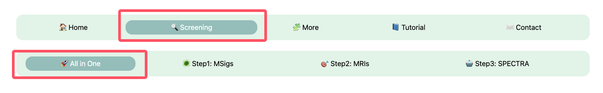

In the input area, choose whether to load the built-in example dataset or upload
your own CSV file. For a first test, use the example dataset so that you can confirm
the expected workflow and output layout. When uploading your own data, make sure the
table uses sample IDs as rows and microbial taxa/features as columns.

After data are loaded, inspect the preview table before running the model. This is
the easiest place to catch common problems such as an incorrect first column, missing
sample IDs, or non-numeric abundance values.

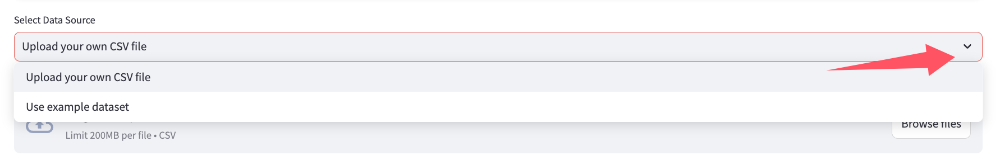

Click **Run All** to start the full pipeline. During execution, the status area
reports progress through input checking, MSigs extraction, MRI calculation, and
SPECTRA prediction. Wait until the pipeline finishes before scrolling to the report
and SHAP sections.

If the run fails, first check whether the uploaded table follows the example CSV
format. Most input-related failures come from feature names, sample IDs, duplicated
columns, or non-numeric values.

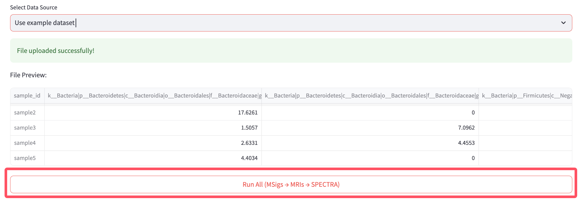

After a successful run, select one sample from the report dropdown and click
**Generate Microbiome Profile Report**. The report highlights the highest
model-estimated possibility first. If you want to inspect additional possibilities,
turn on **Show me more possibilities** and adjust the slider.

The report is intended to help prioritize which model-estimated phenotype patterns
are most prominent for a sample. For multi-sample files, repeat this report selection
for each sample you want to review.

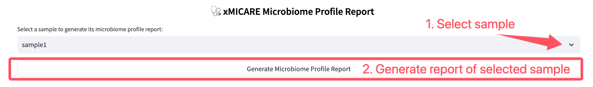

The MRI SHAP section explains which MRI features contributed most to the selected
phenotype estimate for the selected sample. Choose the phenotype and sample you want
to explain, then read the plot by direction and magnitude.

- Positive SHAP values push the selected phenotype estimate higher.
- Negative SHAP values push the selected phenotype estimate lower.
- Larger absolute values indicate stronger model influence.

This section explains the model at the MRI-feature level, not at the individual
taxa level.

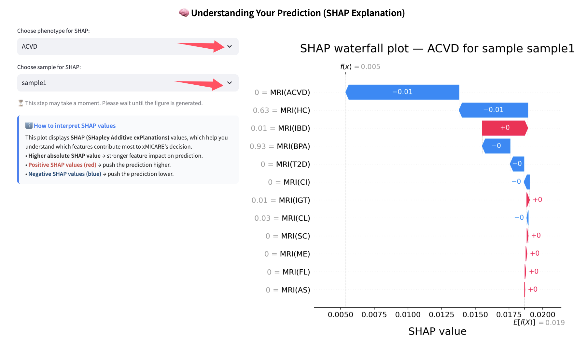

The taxa-level SHAP section explains which taxa have the largest downstream
contribution through MRI features for a selected sample and phenotype. Choose the
sample, choose the phenotype, set how many taxa to display, and then compute the
taxa-level explanation.

Use the table together with the plot: the plot is better for quickly identifying
the largest contributors, while the table is better for copying exact values and
checking the MRI source linked to each taxon.

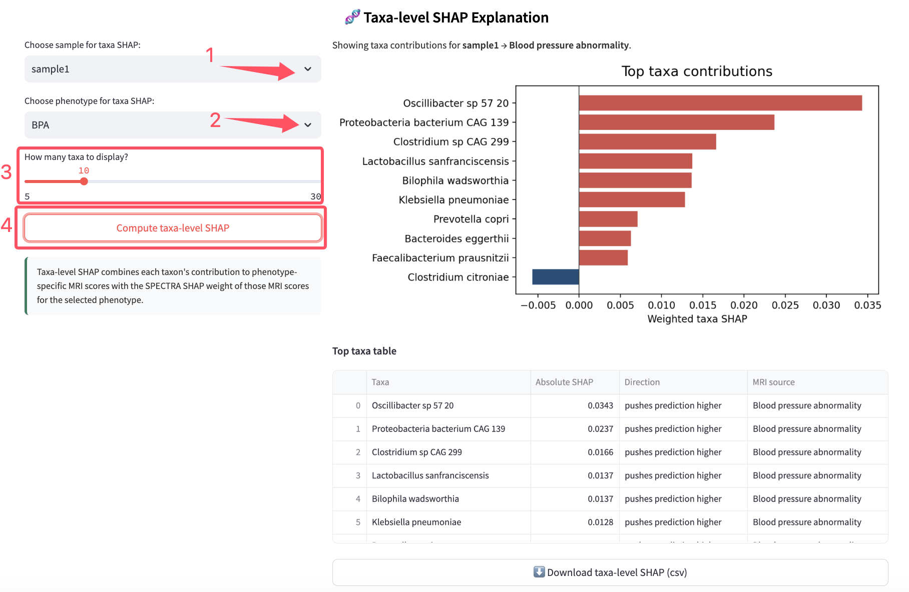

At the bottom of the All in One results, download the tables you want to keep.
Common exports include MRI results, SPECTRA probabilities, and taxa-level SHAP
results. Save these files if you plan to compare results across samples or rerun
downstream analysis outside the web app.

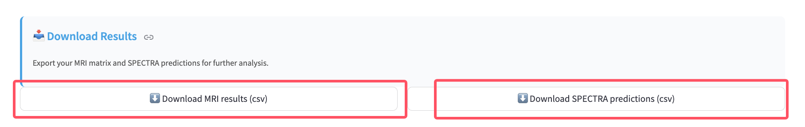

# MSigs

The **MSigs** page calculates phenotype-specific microbial signature presence from
an abundance table. Use this page when you want to inspect or export the microbial
signature matrix before calculating MRI values.

Open the page from **Screening**, then choose the MSigs module in the secondary
navigation bar.

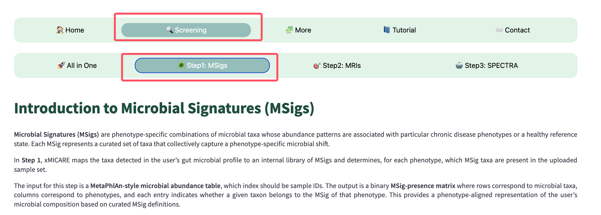

Load an abundance table or use the example dataset. The preview is important here
because MSig extraction depends on taxonomic feature names. If the uploaded table
does not resemble the example format, the app may not be able to map features to
microbial signatures correctly.

Before running the calculation, check that sample IDs are in rows and that microbial
taxa/features are in columns.

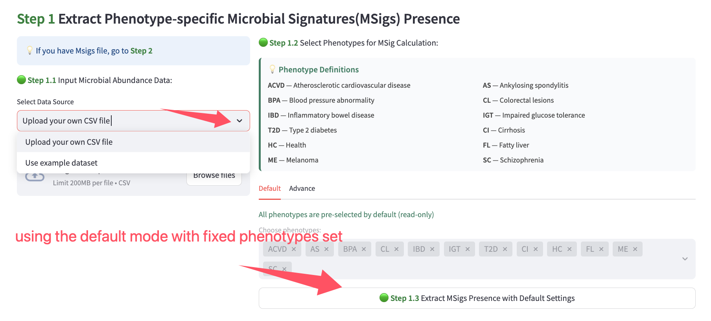

Choose the phenotypes you want to evaluate. The default workflow is appropriate
when you want all available phenotype-specific signatures. Use the customized
phenotype selection only if you intentionally want a smaller output matrix.

Run the calculation after the phenotype selection is set. The result is a matrix
indicating which microbial features are used as signatures for each phenotype.

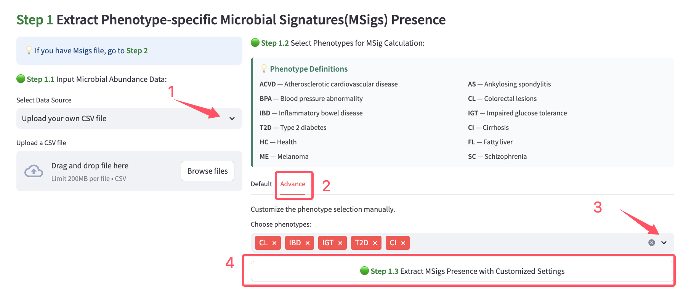

Download the MSig result if you want to run the MRI module separately. The exported
file should be kept together with the abundance table used to generate it, because
the next module expects these inputs to correspond to the same feature space.

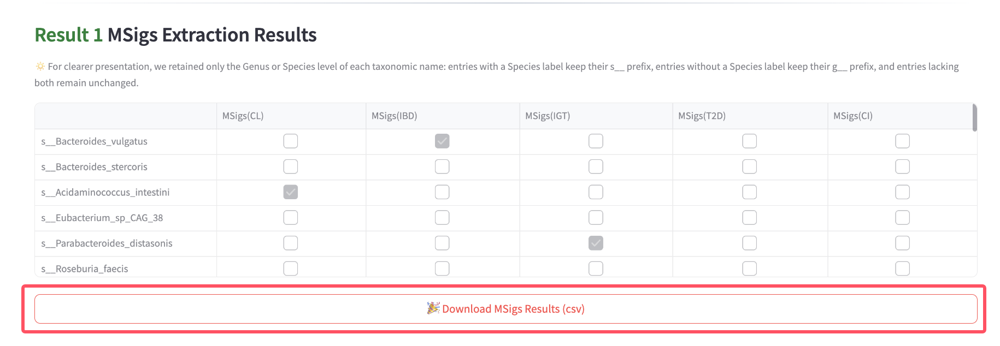

# MRIs

The **MRIs** page calculates phenotype-specific Microbiome Risk Indicators from
microbial abundance values and MSig information. Use this page when you want to
inspect MRI values before running SPECTRA.

Open the page from **Screening**, then choose the MRIs module in the secondary
navigation bar.

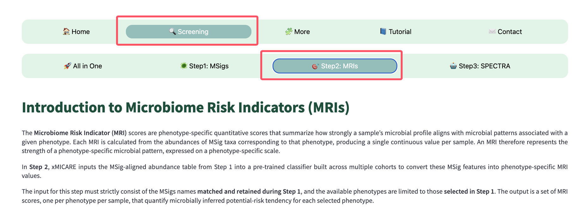

The MRI calculation requires an abundance table and an MSig presence table. In the
default workflow, the app guides you through both inputs and shows previews for
checking whether the files line up.

Make sure both inputs represent the same feature naming convention. If taxa names
are inconsistent between the abundance table and MSig table, the calculated MRI
values may be incomplete or shifted toward zero.

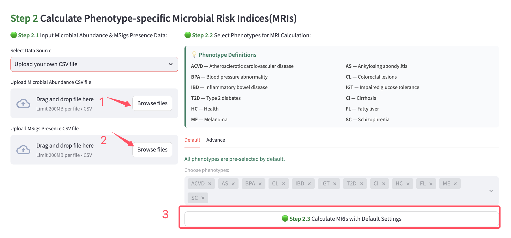

You can load example data to confirm the expected MRI input structure. This is
useful before preparing your own files, especially if you are running the modules
separately instead of using All in One.

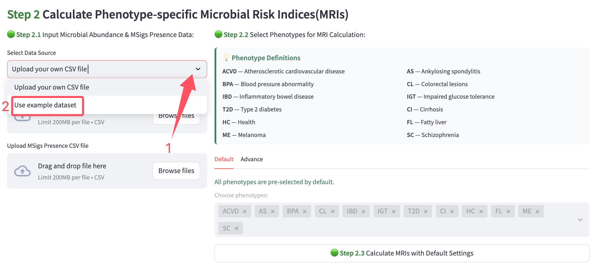

Run the default calculation if you want MRI values for all supported phenotypes.
This is the most common choice when the MRI table will later be used as SPECTRA
input.

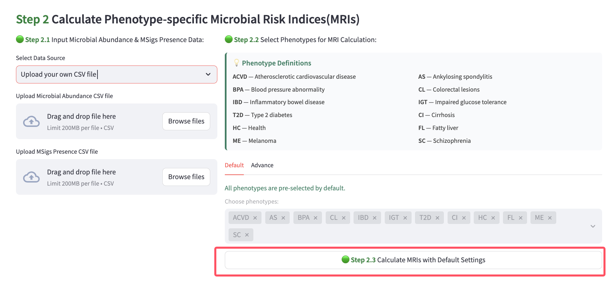

Use customized phenotype selection only when your analysis requires a subset of
MRI values. If you later run SPECTRA, make sure the selected MRI columns are
compatible with the phenotypes you want to predict.

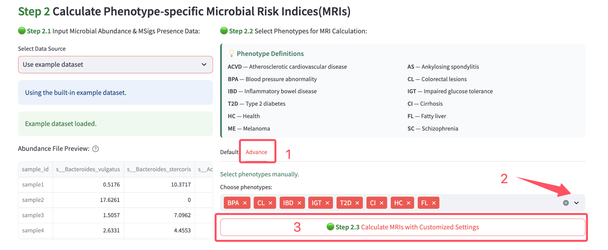

Download the MRI output if you want to use it as input for the SPECTRA page or
analyze MRI values outside the app. Keep the sample IDs unchanged so that reports
and downstream plots can still refer to the correct samples.

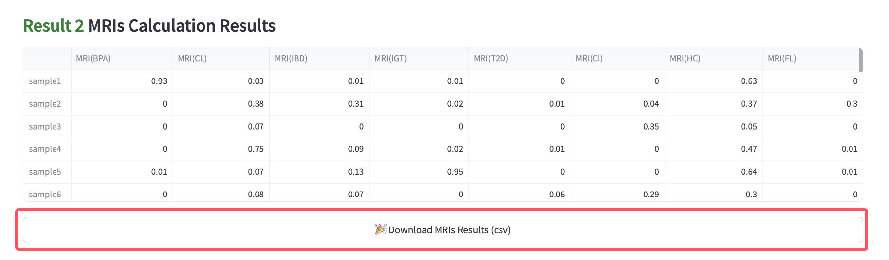

# SPECTRA

The **SPECTRA** page starts from an MRI table and generates phenotype probability
estimates. Use this page when MRI values have already been calculated, or when you
want to test SPECTRA independently from the abundance-to-MRI workflow.

Load an MRI table or use the example data. The input columns should follow the MRI
feature format expected by the model.

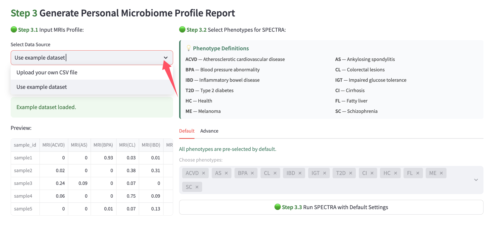

Use the default phenotype setting when you want the full multi-phenotype output.
This is the closest separate-module equivalent to the prediction stage inside
All in One.

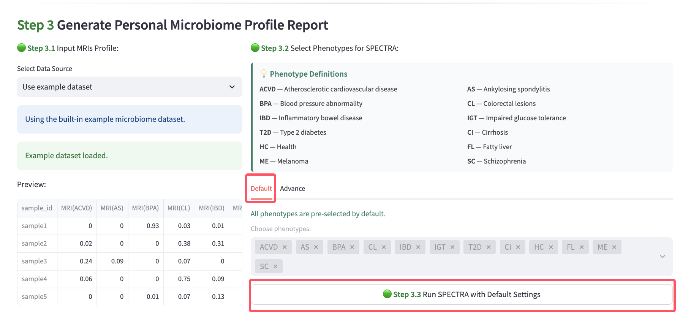

Use customized phenotype selection when you want the probability table to include
only selected phenotype categories. This can make the result easier to inspect, but
it also means the report and SHAP options will be limited to those selected outputs.

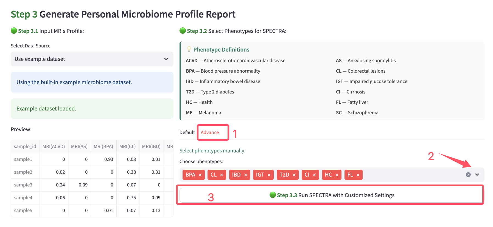

After running SPECTRA, review the probability matrix. Each row corresponds to a
sample, and each column corresponds to a phenotype category included in the run.
Download this table if you need a record of the model-estimated probabilities.

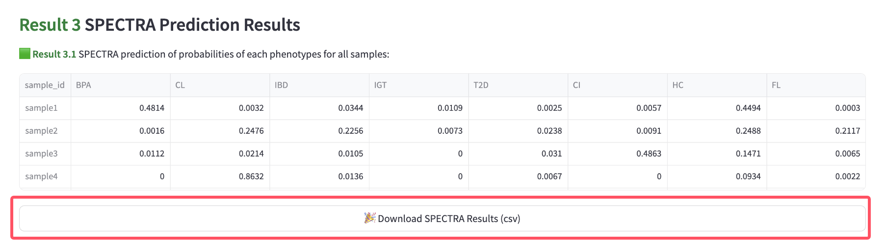

To generate a sample-level report, choose a sample from the dropdown and click the
report button. The report summarizes the strongest model-estimated phenotype
pattern for that sample.

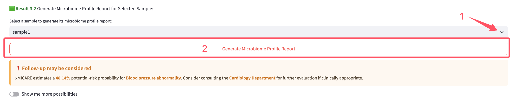

If you want to see additional model-estimated possibilities, turn on the
more-possibilities control and choose how many results to display. This is useful
when the top estimates are close together or when you want a broader view of the
probability ranking.

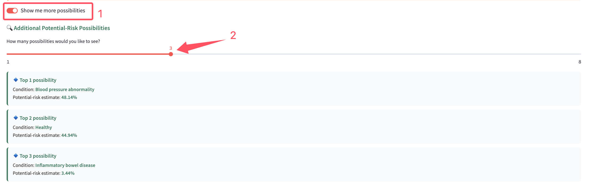

# Input And Result Notes

## Input format

For the main Screening workflow, use a CSV file with samples as rows and microbial
taxa/features as columns. The first column should identify sample IDs, and abundance
values should be numeric. MetaPhlAn-style taxonomic names are recommended for the
main workflow.

For the 16S extension, use the provided 16S example file as a template for the
expected abundance-table structure.

For the high-BMI extension, use a non-negative relative abundance table with samples
as rows and microbial taxa as columns.

## Reading outputs

Model probabilities are model-estimated phenotype possibilities for each sample.
MRI SHAP explains MRI-feature contributions for a selected sample and phenotype.
Taxa-level SHAP summarizes taxa contributions through MRI features for the selected
explanation target. Downloaded CSV files preserve the numerical outputs for later
review or external analysis.

# More

The **More** page provides extension modules for additional application scenarios.
These modules keep a similar workflow to the main Screening page: choose data,
run the model, review the probability table, generate a sample-level report, and
use SHAP explanations to understand selected outputs.

The current More modules are **16S Data** and **High-BMI Population**. For both
modules, the built-in example dataset is the recommended first run because it shows
the expected input layout and result structure.

# 16S Data

The **16S Data** page is available under **More**. Use this page when the input data
are 16S-derived microbial abundance features rather than the main metagenomic
feature format used in the Screening workflow.

The safest way to prepare a compatible file is to start from the provided 16S
example dataset and match its structure. Before running the analysis, check that
samples are arranged in rows and microbial features are arranged in columns.

Recommended workflow:

1. Open **More → 16S Data**.
2. Choose the example dataset or upload a 16S abundance CSV file.
3. Run the 16S model.
4. Review the computed MRI values and SPECTRA probability matrix.
5. Select a sample and generate the report.
6. Choose the exact sample and phenotype for MRI SHAP or taxa-level SHAP.

The report and explanation layout is intentionally similar to All in One, so users
can interpret top possibilities, MRI SHAP, and taxa-level SHAP in the same way.

# High-BMI Population

The **High-BMI Population** page is also available under **More**. Use this page for
the high-BMI population extension. The input is a non-negative relative abundance
table, and the module computes MRI values internally before applying the high-BMI
SPECTRA model.

Recommended workflow:

1. Open **More → High-BMI Population**.
2. Choose the example dataset or upload a relative abundance CSV file.
3. Run the high-BMI model.
4. Review the MRI values and probability matrix.
5. Select a sample and generate the report.
6. Use MRI SHAP and taxa-level SHAP controls to explain selected predictions.

This page is intended for high-BMI population analysis. Use the example data as a
reference for preparing custom abundance tables, and confirm the sample IDs and
microbial feature columns in the preview before running the model.
